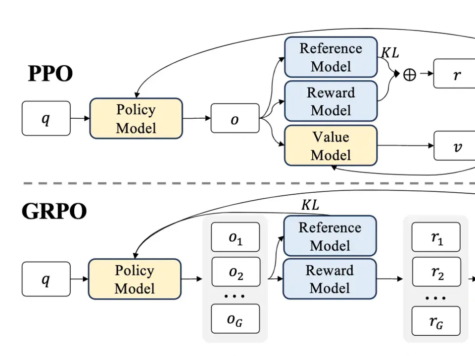
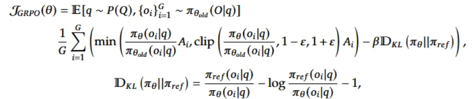
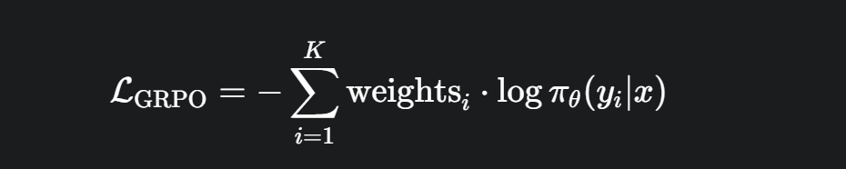
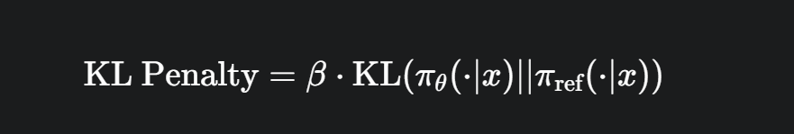

# 📘 Understanding Group Relative Policy Optimization(GRPO)

A guide to the theory and implementation of **GRPO** for aligning Large Language Models (LLMs).

---

##  Overview
This repository provides a **technical explanation** of the Group-wise Policy Optimization (GRPO) algorithm, a method for aligning LLMs with human preferences or specific objectives. It explains the **core equations** and connects them to a **practical Python implementation**.

---

## 🎯 1. The Goal: LLM Alignment
The aim of GRPO is to fine-tune a base LLM (**reference policy** `π_ref`) to create a new, improved model (**learned policy** `π_θ`).

### 📌 Formal Objective:


- **π_θ(y|x)**: Probability of the fine-tuned model generating response `y` for prompt `x`.
- **π_ref(y|x)**: Probability of the base model generating the same response.
- **r(x, y)**: Reward function scoring each response.
- **β**: KL-divergence coefficient (penalizes deviation).
- **KL(π_θ || π_ref)**: Keeps the new model close to the reference.

✅ **Goal:** Maximize reward while preventing catastrophic forgetting.

---

## 📚 2. GRPO Loss: Theory to Practice

### 🔹 Step 1: Generate a Group of Responses
For each prompt `x`, generate `K` responses:
```python
# K = group_size_k
generated_outputs = model.generate(
    prompt_tokens,
    max_new_tokens=256,
    num_return_sequences=group_size_k,  # Generate K responses
    do_sample=True,
)
````

### 🔹 Step 2: Calculate Rewards & Weights

Use a reward function and apply **Softmax** to compute normalized weights:


```python
# Get raw reward scores r_i
rewards = torch.tensor(
    combined_reward_function(prompts, completions, answers), 
    device=device
)

# Apply softmax to get weights
weights = F.softmax(rewards, dim=0)
```

### 🔹 Step 3: Weighted Log-Likelihood Loss

Update `π_θ` to favor high-reward responses:



```python
total_loss = 0
for i in range(group_size_k):
    log_probs = -F.cross_entropy(
        response_logits.view(-1, response_logits.size(-1)), 
        response_tokens_masked.view(-1)
    )
    total_loss += weights[i] * log_probs

final_loss = -total_loss
final_loss.backward()
optimizer.step()
```

---

## 🔧 3. Stabilizing Training

###  PPO-Style Clipping


Prevents large, destabilizing updates.

###  KL Penalty (β)



Keeps policy close to the reference to avoid reward hacking.

* **High β:** Safer, less deviation.
* **Low β:** More exploration, risk of forgetting base knowledge.

---

## 📂 Repository Structure

```
📦 grpo-llm
 ┣ 📜 README.md
 ┣ 📜 grpo_training.py
 ┣ 📜 reward_function.py
 ┣ 📂 images/
 ┃ ┣ grpo_objective.png
 ┃ ┣ softmax_weights.png
 ┃ ┣ grpo_loss.png
 ┃ ┣ ppo_clipping.png
 ┃ ┗ kl_penalty.png
 ┣ 📂 models/
 ┗ 📂 data/
```

---

## 📜 References

* **GRPO** – [Group-Relative Policy Optimization](https://arxiv.org/abs/2502.01652).
* **PPO:** [Proximal Policy Optimization Algorithms](https://arxiv.org/abs/1707.06347)
* **DPO:** [Direct Preference Optimization](https://arxiv.org/abs/2305.18290)

---

## 🤝 Contributing

Contributions, pull requests, and discussions are welcome! 

---

